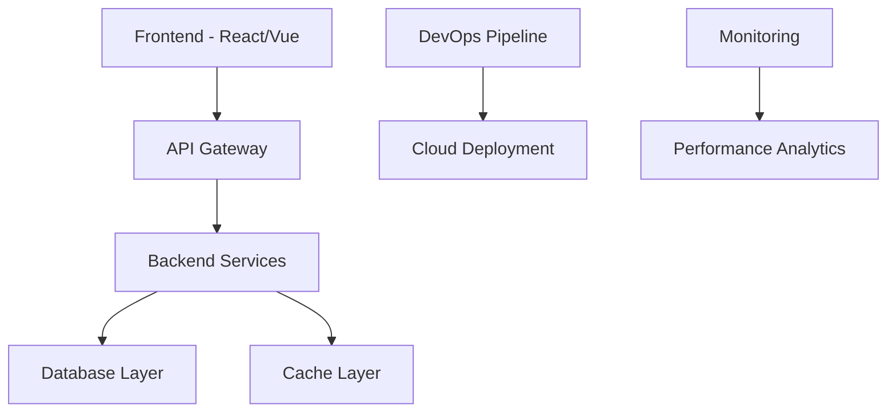

# 🚀 Full Stack Developer

<div align="center">
  <h1>👋 ¡Hola! Soy [Tu Nombre]</h1>
  <h3>🚀 Full Stack Engineer | 🌐 End-to-End Solutions | 💡 Problem Solver</h3>
  
  
</div>

## 🎯 Sobre mí

Desarrollador full stack con pasión por crear aplicaciones completas desde el concepto hasta el despliegue. Me especializo en conectar el frontend y backend para crear experiencias de usuario seamless respaldadas por arquitecturas robustas.

- 🔭 Desarrollando **[Aplicación Full Stack actual]**
- 🌱 Explorando **[Nueva tecnología/stack]**
- 👯 Colaborando en **proyectos end-to-end innovadores**
- 💬 Pregúntame sobre **React, Node.js, Python, DevOps, System Design**
- 📫 Contacto: **[tu-email@ejemplo.com]**
- ⚡ Fun fact: **[Algo sobre tu experiencia full stack]**

## 🛠️ Full Stack Toolkit

### 🎨 Frontend


### ⚙️ Backend


### 🗄️ Databases


### ☁️ DevOps & Cloud


### 🔧 Tools & Others


## 📊 GitHub Stats

<div align="center">
  
  
</div>

<div align="center">
  
</div>

## 🎯 Full Stack Projects

### 🛍️ [E-Commerce Platform Completa](link-proyecto)
Plataforma de comercio electrónico end-to-end con panel de administración.

**Frontend:** React, TypeScript, Tailwind CSS, Redux Toolkit  
**Backend:** Node.js, Express, MongoDB, JWT Auth  
**DevOps:** Docker, AWS EC2, GitHub Actions  

**Features:** 
- 🛒 Carrito de compras dinámico
- 💳 Integración con Stripe
- 📊 Dashboard de analytics
- 📱 PWA con notificaciones
- 🔐 Autenticación multi-factor

[🔗 Live Demo](demo-link) | [💻 Frontend](github-link) | [⚙️ Backend](github-link)

### 📱 [Social Media App](link-proyecto)
Red social completa con chat en tiempo real y feed inteligente.

**Frontend:** Next.js, Socket.io, Chakra UI  
**Backend:** Python, FastAPI, PostgreSQL, Redis  
**DevOps:** Docker Compose, Railway deployment  

**Features:**
- 💬 Chat en tiempo real
- 📸 Subida de imágenes
- 🤖 Algoritmo de feed
- 🌙 Modo oscuro/claro
- 📊 Analytics de posts

[🔗 Live Demo](demo-link) | [💻 Monorepo](github-link)

### 📊 [Task Management SaaS](link-proyecto)
Plataforma de gestión de proyectos con colaboración en equipo.

**Frontend:** Vue 3, Vite, Pinia, TypeScript  
**Backend:** Django REST, Celery, PostgreSQL  
**DevOps:** Kubernetes, Google Cloud Platform  

**Features:**
- 👥 Colaboración en tiempo real
- 📈 Reporting avanzado
- 🔄 Sincronización offline
- 📧 Notificaciones por email
- 🎨 Temas personalizables

[🔗 Live Demo](demo-link) | [💻 Código](github-link)

## 🏗️ Arquitectura Full Stack



## 💼 Stack Especializations

<div align="center">

| Stack | Frontend | Backend | Database | Deployment |
|-------|----------|---------|----------|------------|
| **MERN** | React | Node.js + Express | MongoDB | Vercel + Railway |
| **PEVN** | Vue 3 | Express + Node.js | PostgreSQL | Netlify + Heroku |
| **Next + FastAPI** | Next.js | Python + FastAPI | PostgreSQL | Vercel + AWS |
| **Full Django** | Django Templates | Django REST | PostgreSQL | Docker + GCP |

</div>

## 🎯 Core Competencies

- **🎨 Frontend Development** - UI/UX, Responsive Design, State Management
- **⚙️ Backend Engineering** - APIs, Database Design, Authentication
- **🔗 System Integration** - Connecting services, Third-party APIs
- **📱 Mobile Development** - React Native, PWAs
- **☁️ DevOps & Deployment** - CI/CD, Containerization, Cloud Platforms
- **🔍 Testing** - Unit, Integration, E2E testing
- **📊 Performance Optimization** - Frontend & Backend optimization
- **🔐 Security** - Authentication, Authorization, Data Protection

## 📚 Últimos Artículos

<!-- BLOG-POST-LIST:START -->
- [From Idea to Production: Building a Full Stack App in 2024](link)
- [Microservices vs Monolith: A Full Stack Perspective](link)
- [Optimizing Full Stack Performance: Frontend to Database](link)
- [Modern Authentication Patterns for Full Stack Apps](link)
<!-- BLOG-POST-LIST:END -->

## 🌐 Connect With Me

<div align="center">

[](https://tu-portfolio.com)
[](https://linkedin.com/in/tu-perfil)
[](https://twitter.com/tu-usuario)
[](https://dev.to/tu-usuario)
[](mailto:tu-email@gmail.com)

</div>

## 🏆 Achievements & Certifications

- 🥇 **Full Stack JavaScript Developer** - [Institución]
- ☁️ **AWS Solutions Architect Associate**
- 🐳 **Docker Certified Associate**
- ⚛️ **React Professional Certification**
- 🐍 **Python Full Stack Developer Certification**

## 💡 Development Philosophy

```javascript
const fullStackMindset = {
  userFirst: "Always prioritize user experience",
  scalability: "Build for growth from day one",
  security: "Security is not optional",
  performance: "Every millisecond matters",
  learning: "Stay curious, stay updated",
  collaboration: "Great products are built by teams"
};
```

## 📈 Contribution Activity


---

<div align="center">
  
  
  
  **"Full stack development is not about knowing everything, it's about understanding how everything connects."**
  
  🚀 **Building the future, one full stack application at a time** 🚀
  
</div>

---

## 🔧 Instrucciones de personalización

1. Reemplaza `[Tu Nombre]` con tu nombre real
2. Cambia `TU_USERNAME` por tu nombre de usuario de GitHub
3. Actualiza la información personal y especialidades
4. Modifica las tecnologías según tu stack preferido
5. Reemplaza los proyectos con tus propias aplicaciones
6. Actualiza los enlaces de demos y repositorios
7. Personaliza las certificaciones y logros
8. Cambia los enlaces de redes sociales y portfolio
9. Actualiza los artículos del blog
10. Ajusta el tema de colores (actualmente "radical")
